# Customer Churn Analysis

## Project Overview

This project focuses on analyzing customer data to predict churn in a telecommunications company. The primary objective is to identify key factors that contribute to customer churn and to build a predictive model that can accurately identify customers who are likely to leave. By understanding the drivers of churn, businesses can implement targeted retention strategies to reduce customer attrition.

---
## Table of Contents

- [Project Overview](#project-overview)
- [Objectives](#objectives)
- [Data Source](#data-source)
- [Methodology](#methodology)
  - [1. Data Loading and Initial Exploration](#1-data-loading-and-initial-exploration)
  - [2. Data Cleaning and Preprocessing](#2-data-cleaning-and-preprocessing)
  - [3. Exploratory Data Analysis (EDA)](#3-exploratory-data-analysis-eda)
  - [4. Feature Engineering](#4-feature-engineering)
  - [5. Model Building](#5-model-building)
  - [6. Model Evaluation](#6-model-evaluation)
  - [7. Feature Importance](#7-feature-importance)
- [Libraries and Tools Used](#libraries-and-tools-used)
- [Key Findings and Results](#key-findings-and-results)
- [Conclusion](#conclusion)
- [Future Work](#future-work)
- [How to Run](#how-to-run)
- [Contributors](#contributors)

---
## Objectives

* To understand the patterns and characteristics of customers who churn versus those who do not.
* To identify the most significant features influencing customer churn.
* To build and evaluate various machine learning models for churn prediction.
* To provide actionable insights for customer retention strategies.
* To analyze the distribution of churn across different customer segments.

---
## Data Source
* **Dataset** : [Download](https://zhang-datasets.s3.us-east-2.amazonaws.com/telcoChurn.csv)
* **Description**: The dataset was sourced from a telecom provider and contains 7043 customer records with 21 features. It includes customer demographics, account information, services subscribed, and churn status.
* **Features**: `customerID`, `gender`, `SeniorCitizen`, `Partner`, `Dependents`, `tenure`, `PhoneService`, `MultipleLines`, `InternetService`, `OnlineSecurity`, `OnlineBackup`, `DeviceProtection`, `TechSupport`, `StreamingTV`, `StreamingMovies`, `Contract`, `PaperlessBilling`, `PaymentMethod`, `MonthlyCharges`, `TotalCharges`, `Churn`
* **Target Variable**: `Churn` (Yes/No)

---
## Methodology

The project follows a standard data science workflow:

### 1. Data Loading and Initial Exploration
* Loaded the dataset using Pandas from a CSV file.
* Performed initial checks:
    * **Data Shape**: (7043, 21)
    * **Data Types**: Mixed numeric and object types.
    * **Basic Statistics**: Examined numerical features using `df.describe()`.
    * **Missing Values Check**: Found 11 missing values in `TotalCharges`.

### 2. Data Cleaning and Preprocessing
* **Missing Values**: Handled 11 missing values in `TotalCharges` by converting to numeric and dropping NA values.
* **Data Type Conversion**: Converted `TotalCharges` from object to numeric type.
* **Categorical Variable Encoding**: Prepared categorical features for analysis (status: not yet encoded in current notebook).
* **Feature Scaling**: Implemented

### 3. Exploratory Data Analysis (EDA)
* **Churn Distribution**: Visualized the target variable, revealing a distribution of 73.4% No Churn and 26.6% Churn.
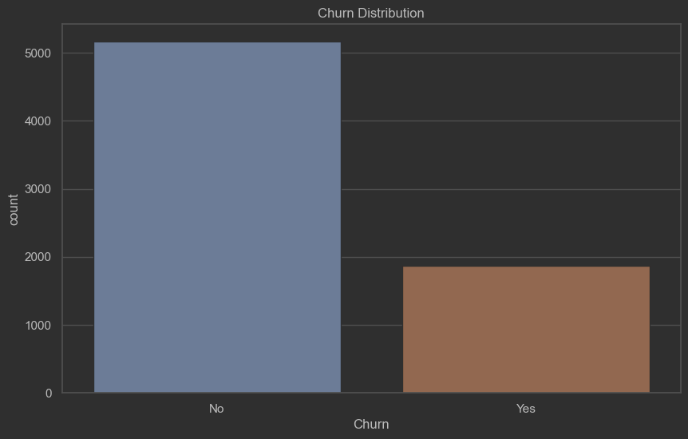

* **Univariate Analysis**: Examined distributions of numerical features and counts for categorical features.
* **Bivariate Analysis**: Created countplots for all categorical features against churn status to observe relationships.
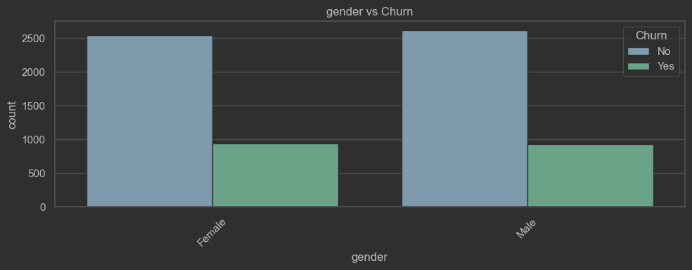
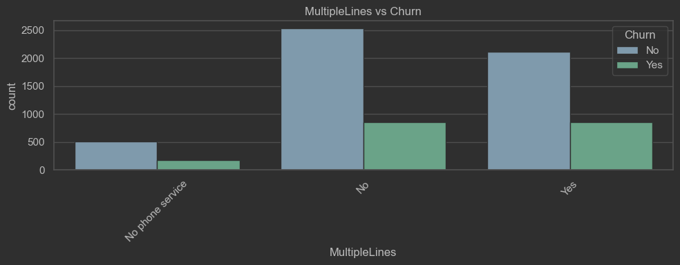
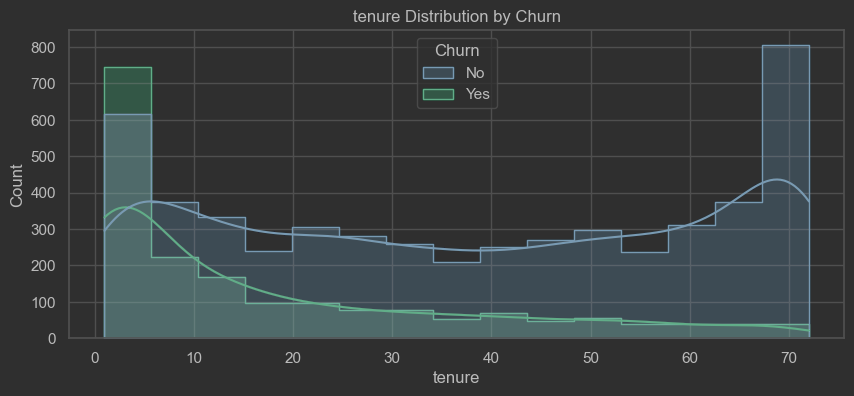
* **Correlation Analysis**:Implemented
* 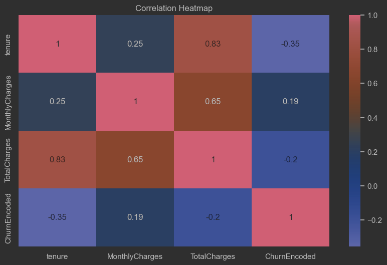

### 4. Feature Engineering
* **Feature Selection**: All features were initially considered for analysis.
* **New Features**: Created a tenure group from the tenure feature which was numerical


### 5. Model Building
* **Data Splitting** : use the 80-20 split cross validation
* **Models Training** : Trained : Logistic Regression , Random Forest , XGBoost, Ada Boost , Gradient Boosting and a simple Neural Network
* **Handling Class Imbalance** : Used SMOT analysis
* **Hyperparameter Tuning** : Used Optuna to do hyper-parameter tuning

### 6. Model Evaluation
* **Metrics Used** : AUC-ROC
* **Model Performance Comparison**
    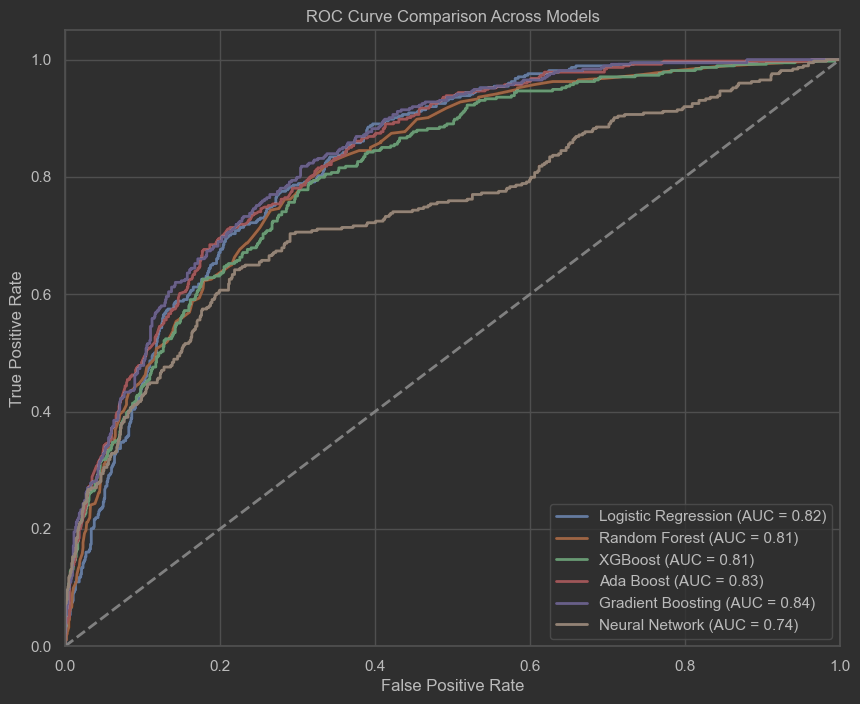

* **Best Model Performance**
 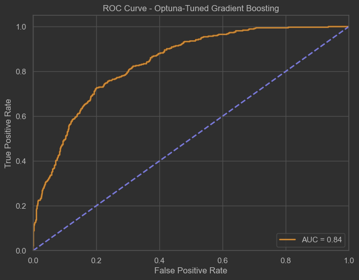

### 7. Feature Importance
We used SHAP and LIME for feature importance analysis
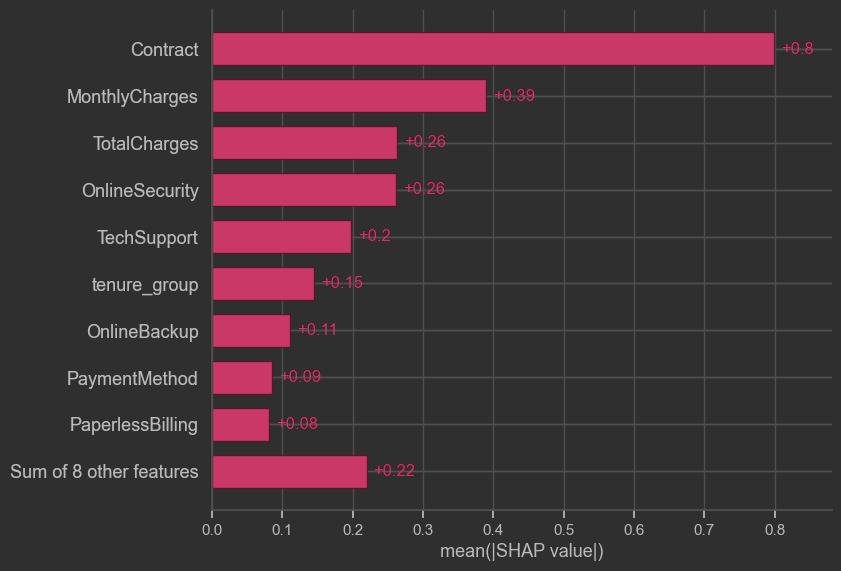
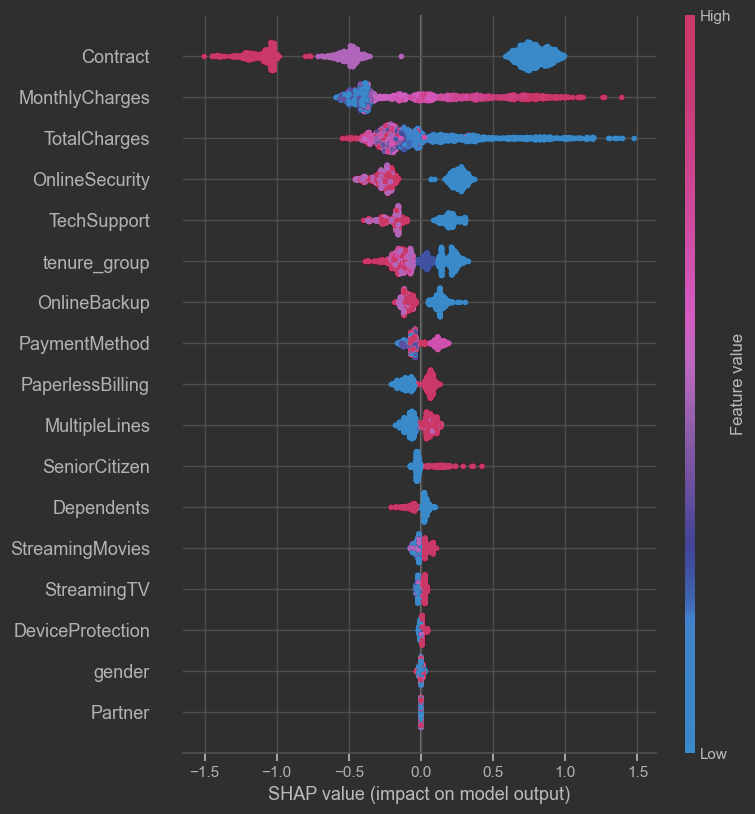
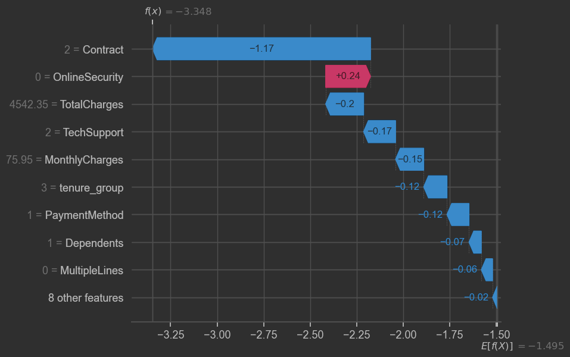
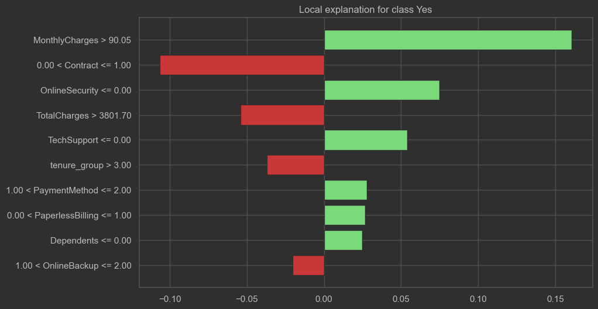
---
## Libraries and Tools Used

* **Python >= 3.10**  
* **Pandas**: For data manipulation and analysis.  
* **NumPy**: For numerical operations.  
* **Matplotlib**: For basic visualization.  
* **Seaborn**: For advanced statistical visualizations.  
* **Scikit-learn**: Used for classification algorithms (Logistic Regression, Random Forest, Gradient Boosting, AdaBoost, Decision Trees), data preprocessing, model selection, and performance evaluation.
* **XGBoost**: For optimized gradient boosting models.  
* **LIME**: For local interpretable model explanations.  
* **SHAP**: For model interpretability and feature importance.  
* **Optuna**: For hyperparameter tuning.  
* **TensorFlow Keras**: For building and training neural networks.  
* **Jupyter Notebook**: As the development environment.  

---
## Conclusion


---
## How to Run

1.  Clone the repository:
    ```bash
    git clone https://github.com/ronaldkanyepi/Customer-Churn-Analysis
    ```
2.  Navigate to the project directory:
    ```bash
    cd customer-churn-analysis 
    ```
    *(Assuming 'customer-churn-analysis' is your project directory name. Adjust if different.)*

3.  Install the required dependencies (it's recommended to use a virtual environment):
    ```bash
    pip install -r requirements.txt
    ```
    *(To create `requirements.txt`, run `pip freeze > requirements.txt` in your project's virtual environment after installing all necessary packages like pandas, numpy, matplotlib, seaborn, scikit-learn.)*

4.  Open the Jupyter Notebook:
    ```bash
    jupyter notebook "Customer Churn Analysis.ipynb"
    ```
5.  Run the cells in the notebook sequentially to reproduce the analysis.
--
## Future Work

To further enhance the churn prediction pipeline and maximize business impact, the following initiatives are recommended:

- **Personalized Retention Strategies**  
  - Implement targeted offers (e.g., discounts, loyalty rewards, or service upgrades) for high-risk customers identified by the model to proactively reduce churn.

- **Proactive Customer Support**  
  - Introduce early warning systems that flag at-risk customers for immediate outreach. Assign dedicated account managers or support teams to improve satisfaction and loyalty.

- **Enhanced Customer Engagement**  
  - Develop campaigns to educate customers on service features through personalized content, usage alerts, and tips—reinforcing perceived product value and reducing churn likelihood.

- **Segment-Based Targeting**  
  - Use model-driven customer segmentation to tailor retention efforts by risk tier (e.g., high, medium, low). This ensures efficient allocation of retention resources across different customer profiles.

- **Real-Time Scoring Integration**  
  - Deploy the trained model in a production environment to score customers in real time and trigger automated retention workflows.

- **Feedback Loop & Continuous Learning**  
  - Regularly retrain models with updated customer data to capture evolving behavior patterns, and incorporate customer feedback to refine prediction accuracy.
---
## Conclusion

This project effectively identified the key drivers behind customer churn and built predictive models to flag high-risk customers. Among all models tested, **Gradient Boosting** demonstrated the best performance in terms of AUC-ROC, making it the most reliable model for churn prediction in this case.

Through thorough exploratory data analysis and targeted feature engineering, we uncovered actionable patterns in customer behavior. Interpretability tools such as **SHAP** and **LIME** further helped in explaining model predictions and highlighting the most influential features.

These insights empower telecom providers to implement personalized retention strategies, improve service quality, and proactively engage at-risk customers. Future enhancements could include real-time prediction systems and continuous learning pipelines based on new customer data.


---
## Contributors

* [Ronald Nyasha Kanyepi](https://www.linkedin.com/in/ronald-nyasha-kanyepi/)
* [GitHub](https://github.com/ronaldkanyep)